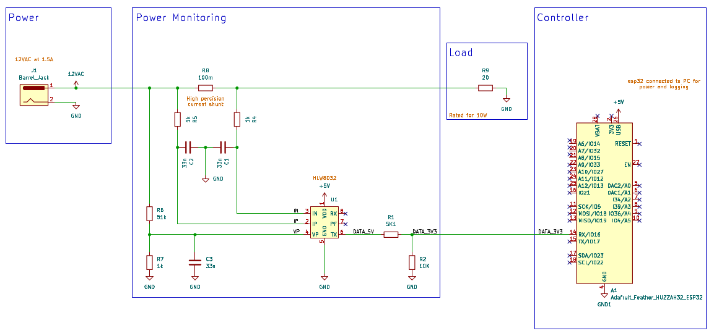

# HLW8032
The HLW8032 is a high precision energy metering IC that uses a CMOS process and is primarily used in single phase applications. It measures line voltage and current and can calculate active power, apparent power and power factors. The device integrates two $\Sigma\Delta$ ADCs and a high-precision energy metering core. HLW8032 can communicate data through UART port. HLW8032 adopts 5V power supply, built-in 3.579M crystal oscillator and 8PIN SOP package. HLW8032 has the advantages of high precision, low power consumption, high reliability, strong applicable environment, etc. It is suitable for electric energy measurement of single-phase two-wire power users.

## Features

1. It can measure the active power, apparent power, current and voltage RMS  

2. Active energy pulse PF pin output 

3. In the dynamic range of 1000:1, the measurement error of active power reaches 0.2% 

4. In the dynamic range of 1000:1, the effective current measurement error reaches 0.5%. 

5.  In the dynamic range of 1000:1, the effective voltage measurement error reaches 0.5%. 

6.  Built-in frequency oscillator 

7.  Built-in voltage reference Source 

8.  built-in power monitoring circuit 

9.  UART communication mode 

10. **SOP8** package type 

## Pin out

  

## Typical Application

### Application Notes

For the following design two 5V supplies are used: one isolated for the MCU and one non-isolated for the HLW8032. Isolation can be achieved with a current type voltage transformer and current transformer together; details found [here][isolated energy monitor design].

If a 3v3 MCU (e.g. an ESP32) is used, you'll need a level shifter since the GPIO pins will likely not be 5v tolerant.

[isolated energy monitor design]: https://w.electrodragon.com/w/HLW8032_SDK

  

## To Do

- Update examples
- Add unit tests